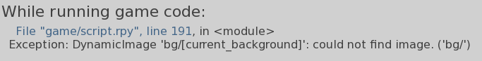

Doki Doki AI Edition (DDAE) is a DDLC mod that implements a more interactive form of roleplay by using sprites to spice up the AI generated text.
The sprites used are decided by the AI based on how you interact with it.

If you have extra questions or want to become apart of the community you can join the discord server here: https://discord.gg/rDA7ehBSq7

If you've been **banned** from the server you can appeal here: https://forms.gle/E8wyDi9aBzXdWvf99

# Examples

# Setup

If you've never downloaded a DDLC mod before then follow this guide <a href="SETUP.md">here</a>

# Frequently Asked Questions

## Why does it take forever to load?

2 Main reasons for this.
1. An error happened and you should check your `log.txt` file in the main folder and send it in #support
2. Hardware limitation. If you don't have a good enough device then it's going to take a while to respond.

If it's a hardware limitation you should check out this project https://github.com/zeeblo/DDAE-Groq which uses an API version of the mod.

## Are my chats private?

Yes. Your chats are completely localized on your machine, even if you turn your internet off, it'll still work.

## Does this use chatgpt?

No. No paid APIs are used in the mod.

## Will it delete my files

No. The fangame in the video is different from the mod and it doesn't have the ability to execute code on your machine. I also don't plan on doing this, since that's basically just malware.

## Are the models uncensored

It depends on what model you're using. You can go to https://ollama.com/library to find uncensored models but they may not follow the system prompt as well which would cause the game to not function correctly.

Secondly, they may not be entirely uncensored. There are certain questions that it may refuse, but since it's a local model you can attempt to jailbreak it as much as you want.

## Can I trust Ollama?

As much as you trust all the other apps you use daily.
Jeffrey Morgan is one of the founders and he has a credible background by previously working for docker, twitter and google.

The project is also used by google in firebase https://firebase.google.com/docs/genkit/plugins/ollama

And obviously, the project is open-sourced.

## Why do the models sometime return "ERROR"?

This happens when the model doesn't respond with the instructed format. This typically happens on regular models if you say something too provacative. 

There's a few solutions to this.

The first is to use an uncensored model. 

The second thing you could try is continuing the chat by ignoring the error message and try to force the ai back into a roleplay state

And the 3rd thing you could try is just jailbreaking the ai model by editing the
system prompt to make the ai say anything.

## What hardware do I need?

You should be able to run the mod on low-end devices like a laptop with 4GB of RAM
and 4GB of VRAM but the speed at which you get a response is going to be slow.

If you want faster responses you need more VRAM. Regular RAM allows you to run models.

## I keep getting this error

When in doubt, restart.

This typically means the model didn't properly generate a background when you first loaded the game.
To fix this you can completely close the game and try loading a new one.

You could also edit the chat file for the old world and try loading it again.

# Credits

**Developer:**
[Zeeblo](https://github.com/zeeblo)

**Logo Design:**
[Infernog](https://x.com/Infernog05) (& another user who wishes to stay anonymous)

**Voice Acting:**
[Jayce Parisi](https://jayceparisi.com/) (**Note:** Jayce would not be comfortable w/ their voice being AI generated so keep that in mind if you're making a submod) 

## Special thanks

- Thanks to Retronika & iiTzWolfyy for the Character template gui & script used when a user first creates a realm
- sutemo for the male sprites https://sutemo.itch.io/male-character-sprite-for-visual-novel
- midjorney generated render of Monika (used in the only CG scene in the game)
