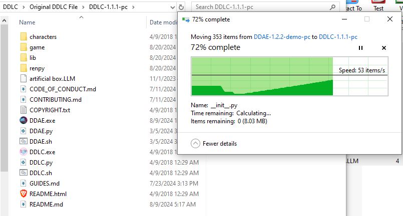
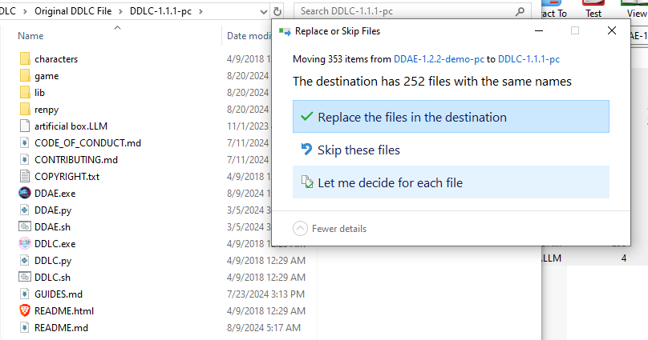

If you've never downloaded a DDLC mod before then follow this guide. If you already know how to setup a DDLC mod then you can ignore this.

# Windows/Linux


- Make sure you have a fresh install of DDLC https://teamsalvato.itch.io/ddlc
- When you click on the download button this popup should appear


- You don't have to pay for it just click "No thanks, just take me to the downloads"
- You'll be taken to this page


- Download the version that says windows
- Extract the zip file that you just downloaded


- Your folder should now look like this


Now you need the actual mod.

- Go to the github repo https://github.com/doki-doki-ai-edition/Mod
- Click on the latest Release


- Now click on "DDAE-x.x.x-demo-pc.zip" or whatever the latest release version is at this time. Make sure it ends with "demo-pc"


I've placed the zip file in the same folder as the original ddlc game folder.


Open up the zip file and copy all the files in the folder.

Note: When you open the zip file, you'll likely only see one folder,
simply go into that folder and copy everything inside it.


Drag or paste all the files in the original DDLC folder



A popup will appear asking you if you should replace all the files,
click replace




You're done! Now all you have to do is click on the DDAE.exe file and start the mod.


If you're on a Linux machine then you need to execute the DDAE.sh file. eg.

```r
/home/zee/Desktop/DDLC-1.1.1-pc/DDAE.sh
```


