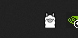

If you've never downloaded a DDLC mod before then follow this guide

(wip)
# Windows

**video tutorial:** https://www.youtube.com/watch?v=VXvidFabia8

- Make sure you have a fresh install of DDLC https://ddlc.moe/
- Download the latest version of the DDAE mod on this github page https://github.com/doki-doki-ai-edition/Mod/releases

To setup the mod just drag the contents into the main ddlc folder.

## Ollama

**Overview:** Ollama is an open-source project that allows people to setup local language models on their machine in a far more user friendly way. They have both uncensored and censored models and the models are quantized (compressed) to run on low-end devices.

**Let's Start!**
- Go to https://ollama.com/download
- Select the Operating system you're using (For example Windows)
- Click on Download

Once it's downloaded, run the application.

If you're on windows you should see a small icon in your taskbar that looks like this

- Open up a terminal on your device (eg. cmd+r if you're using windows, then type "cmd" and press enter)
- In the terminal type "ollama pull llama3.1" (or any model you find in https://ollama.com/library/)

This should be roughly 4.7 gigabytes and once it's done installing you can run the mod!
